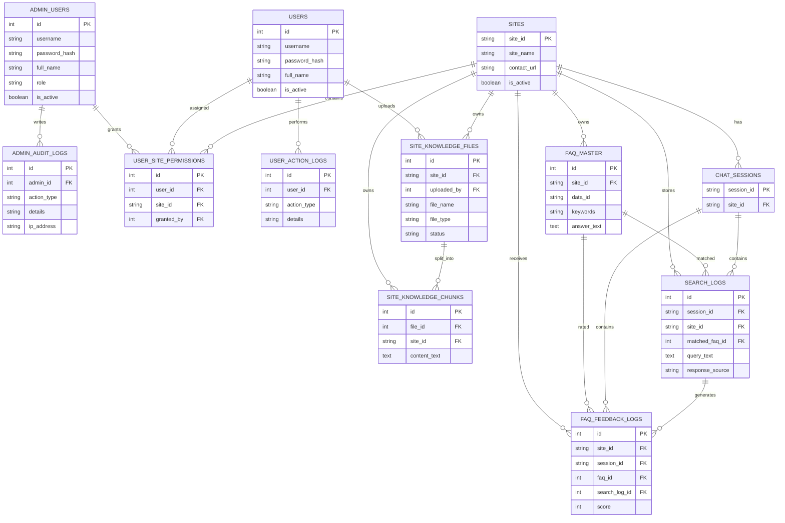

```mermaid
erDiagram

%%========================
%% SUPER ADMIN
%%========================

ADMIN_USERS {
    int id PK
    string username
    string password_hash
    string full_name
    string role
    boolean is_active
}

ADMIN_AUDIT_LOGS {
    int id PK
    int admin_id FK
    string action_type
    string details
    string ip_address
}

%%========================
%% SITE MANAGEMENT
%%========================

SITES {
    string site_id PK
    string site_name
    string contact_url
    boolean is_active
}

USERS {
    int id PK
    string username
    string password_hash
    string full_name
    boolean is_active
}

USER_SITE_PERMISSIONS {
    int id PK
    int user_id FK
    string site_id FK
    int granted_by FK
}

USER_ACTION_LOGS {
    int id PK
    int user_id FK
    string action_type
    string details
}

%%========================
%% AI KNOWLEDGE
%%========================

SITE_KNOWLEDGE_FILES {
    int id PK
    string site_id FK
    int uploaded_by FK
    string file_name
    string file_type
    string status
}

SITE_KNOWLEDGE_CHUNKS {
    int id PK
    int file_id FK
    string site_id FK
    text content_text
}

%%========================
%% FAQ & CHAT
%%========================

FAQ_MASTER {
    int id PK
    string site_id FK
    string data_id
    string keywords
    text answer_text
}

CHAT_SESSIONS {
    string session_id PK
    string site_id FK
}

SEARCH_LOGS {
    int id PK
    string session_id FK
    string site_id FK
    int matched_faq_id FK
    text query_text
    string response_source
}

FAQ_FEEDBACK_LOGS {
    int id PK
    string site_id FK
    string session_id FK
    int faq_id FK
    int search_log_id FK
    int score
}

%%========================
%% RELATIONSHIPS
%%========================

ADMIN_USERS ||--o{ ADMIN_AUDIT_LOGS : writes
ADMIN_USERS ||--o{ USER_SITE_PERMISSIONS : grants

USERS ||--o{ USER_SITE_PERMISSIONS : assigned
USERS ||--o{ USER_ACTION_LOGS : performs
USERS ||--o{ SITE_KNOWLEDGE_FILES : uploads

SITES ||--o{ USER_SITE_PERMISSIONS : contains
SITES ||--o{ FAQ_MASTER : owns
SITES ||--o{ SITE_KNOWLEDGE_FILES : owns
SITES ||--o{ SITE_KNOWLEDGE_CHUNKS : owns
SITES ||--o{ CHAT_SESSIONS : has
SITES ||--o{ SEARCH_LOGS : stores
SITES ||--o{ FAQ_FEEDBACK_LOGS : receives

SITE_KNOWLEDGE_FILES ||--o{ SITE_KNOWLEDGE_CHUNKS : split_into

FAQ_MASTER ||--o{ SEARCH_LOGS : matched
FAQ_MASTER ||--o{ FAQ_FEEDBACK_LOGS : rated

CHAT_SESSIONS ||--o{ SEARCH_LOGS : contains
CHAT_SESSIONS ||--o{ FAQ_FEEDBACK_LOGS : contains

SEARCH_LOGS ||--o{ FAQ_FEEDBACK_LOGS : generates
```